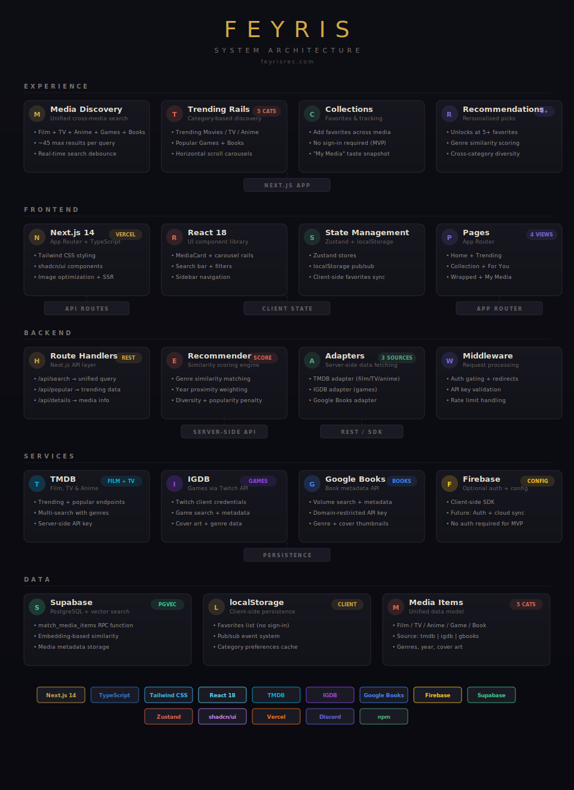

<p align="center">
  
</p>

<h1 align="center">Feyris</h1>

<p align="center">
  <strong>Cross‑media discovery for films, TV, anime, games, and books.</strong><br/>
  Add favorites and get lightweight, personalized recommendations.
</p>

<p align="center">
  <a href="https://feyrisrec.com">feyrisrec.com</a> · <a href="#quick-start">Quick Start</a> · <a href="#architecture">Architecture</a> · <a href="#roadmap">Roadmap</a>
</p>

<p align="center">
  
  
  
  
  
</p>

---

## Features

- **Unified search** across TMDB, IGDB (via Twitch), and Google Books — films, TV, anime, games, and books in one query
- **Trending rails** with horizontal scroll carousels for each media category
- **One favorites list** stored in localStorage — no sign‑in required
- **Personalized recommendations** unlock after 5+ favorites, powered by genre similarity scoring with cross‑category diversity
- **My Media** taste snapshot showing your collection breakdown
- **Wrapped** — a year‑in‑review style breakdown of your media consumption

---

## Architecture

<p align="center">
  
</p>

The system is organized into five layers:

**Experience** — The user‑facing features: unified media discovery, trending rails, collections/favorites, and the recommendation engine that unlocks at 5+ favorites.

**Frontend** — Next.js 14 with App Router and TypeScript, styled with Tailwind CSS and shadcn/ui components. Client state managed via Zustand stores and a localStorage pub/sub system. Four primary views: Home, Collection, For You, and Wrapped.

**Backend** — Next.js Route Handlers serve as the API layer (`/api/search`, `/api/popular`, `/api/details`). The recommender engine scores media by genre similarity, year proximity, and diversity weighting. Server‑side adapters normalize data from three external sources.

**Services** — TMDB for films, TV, and anime metadata. IGDB via Twitch client credentials for games. Google Books API for book data. Firebase for optional auth and future cloud sync.

**Data** — Supabase with PostgreSQL and `match_media_items` RPC for vector‑based similarity search. localStorage for client‑side favorites persistence. A unified `MediaItem` data model spans all five media categories.

---

## Quick Start

### Prerequisites

- Node.js 18+

### Setup

1. **Clone and install**
   ```bash
   git clone https://github.com/JonathanDunkleberger/Feyris.git
   cd Feyris
   npm install
   ```

2. **Configure environment**
   ```bash
   cp .env.local.example .env.local
   ```
   Fill in the required keys (see [Environment](#environment) below).

3. **Run dev server**
   ```bash
   npm run dev
   ```
   Open [http://localhost:3000](http://localhost:3000)

---

## Environment

### Server‑side (keep secret)

| Variable | Purpose |
|---|---|
| `TMDB_API_KEY` | Film, TV, and anime data from TMDB |
| `TWITCH_CLIENT_ID` | IGDB game data via Twitch API |
| `TWITCH_CLIENT_SECRET` | Twitch OAuth for IGDB access |
| `GOOGLE_BOOKS_API_KEY` | Book metadata from Google Books |

### Client‑side (public)

| Variable | Purpose |
|---|---|
| `NEXT_PUBLIC_FIREBASE_API_KEY` | Firebase client SDK |
| `NEXT_PUBLIC_FIREBASE_AUTH_DOMAIN` | Firebase auth domain |
| `NEXT_PUBLIC_FIREBASE_PROJECT_ID` | Firebase project identifier |
| `NEXT_PUBLIC_FIREBASE_APP_ID` | Firebase app identifier |
| `NEXT_PUBLIC_DISCORD_INVITE_URL` | Community Discord link |

> **Note:** TMDB and IGDB keys are used server‑side only via Route Handlers. Google Books keys can be restricted by domain.

---

## Tech Stack

| Layer | Technology |
|---|---|
| Framework | Next.js 14 (App Router) |
| Language | TypeScript |
| UI | React 18, Tailwind CSS, shadcn/ui |
| State | Zustand, localStorage pub/sub |
| APIs | TMDB, IGDB (Twitch), Google Books |
| Database | Supabase (PostgreSQL + pgvector) |
| Auth | Firebase (optional) |
| Hosting | Vercel |

---

## Project Structure

```
Feyris/
├── app/                    # Next.js App Router
│   ├── api/                # Route Handlers (search, popular, details)
│   ├── _lib/
│   │   ├── adapters.server.ts   # TMDB, IGDB, Google Books adapters
│   │   └── recommender.ts       # Genre similarity scoring engine
│   └── _state/
│       └── favorites.ts         # localStorage + pub/sub
├── components/             # React UI components
├── hooks/                  # Custom React hooks
├── lib/                    # Shared utilities
├── stores/                 # Zustand state stores
├── scripts/                # Build & utility scripts
├── public/                 # Static assets
├── docs/                   # Documentation & architecture diagrams
├── middleware.ts           # Next.js middleware
└── match_media_items.sql   # Supabase RPC function
```

---

## Data Model

```typescript
type Category = "film" | "game" | "anime" | "tv" | "book";

type MediaItem = {
  id: string;
  source: "tmdb" | "igdb" | "gbooks";
  sourceId: string;
  category: Category;
  title: string;
  year?: number;
  imageUrl?: string;
  genres: string[];
};
```

---

## API Endpoints

| Method | Endpoint | Description |
|---|---|---|
| `GET` | `/api/search?q=…` | Unified search (~45 max results) |
| `GET` | `/api/popular` | Trending pools per category |
| `GET` | `/api/details` | Expanded media detail |

---

## Try It

1. Search for a few titles you love and add them to favorites
2. Hit **5+ favorites** to unlock personalized recommendations
3. Browse **Trending** rails across all media categories
4. Check **My Media** for your taste snapshot
5. Visit **Wrapped** for your media year‑in‑review

---

## Roadmap

- [ ] Detail pages with richer metadata
- [ ] Optional account sync (Firebase Auth) + cloud favorites
- [ ] Shareable profiles and recommendation bundles
- [ ] Stronger diversity and ranking tuning
- [ ] Caching / rate‑limit and basic metrics
- [ ] Accessibility polish

---

## Attribution

- Uses the [TMDB API](https://www.themoviedb.org/) but is not endorsed or certified by TMDB
- Game data via [IGDB](https://www.igdb.com/) / Twitch API
- Book data via [Google Books API](https://developers.google.com/books)
- Logos and trademarks belong to their respective owners

---

## License

MIT — see [`LICENSE`](LICENSE).
